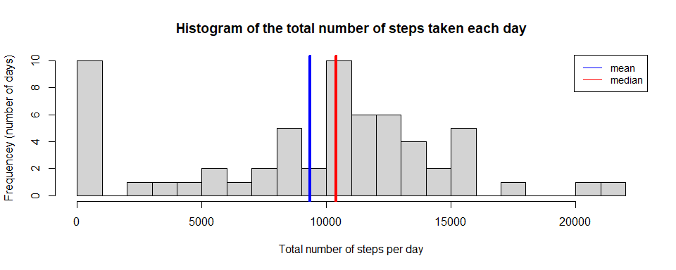
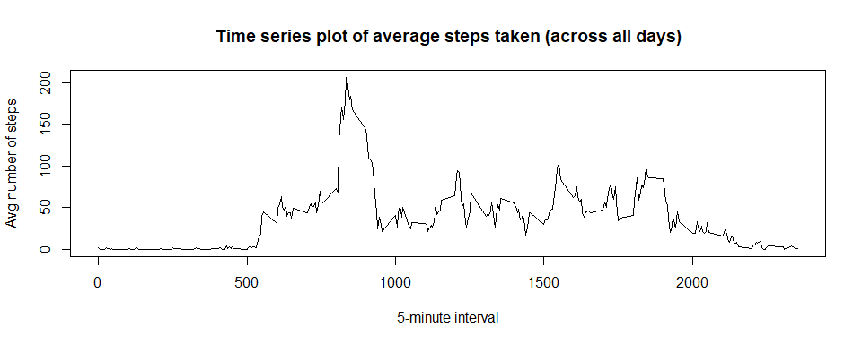
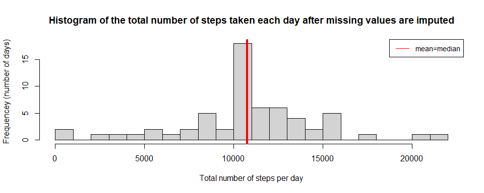
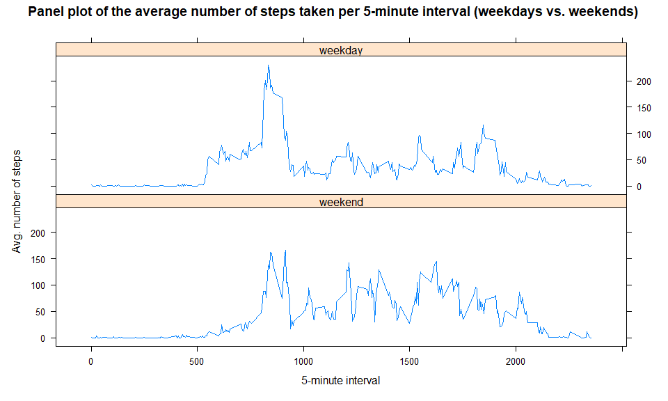

## Loading and preprocessing the data

1. Unzip the original file, load the data and save as *dataset*:

```r
unzip("activity.zip")
dataset <- read.csv("activity.csv")
```

2. Process/transform the date variable into a format suitable for the analysis: 

```r
dataset$date <- as.Date(dataset$date)
```

## What is mean total number of steps taken per day?

1. Calculate the total number of steps taken per day:

```r
library(dplyr)
```

```
## 
## Attaching package: 'dplyr'
```

```
## The following objects are masked from 'package:stats':
## 
##     filter, lag
```

```
## The following objects are masked from 'package:base':
## 
##     intersect, setdiff, setequal, union
```

```r
dailysteps <- dataset %>% 
        group_by(date) %>%
        summarise(dailytotal=sum(steps, na.rm=TRUE))
##head(dailysteps)
```
Print the table:

```r
print(dailysteps)
```

```
## # A tibble: 61 x 2
##    date       dailytotal
##    <date>          <int>
##  1 2012-10-01          0
##  2 2012-10-02        126
##  3 2012-10-03      11352
##  4 2012-10-04      12116
##  5 2012-10-05      13294
##  6 2012-10-06      15420
##  7 2012-10-07      11015
##  8 2012-10-08          0
##  9 2012-10-09      12811
## 10 2012-10-10       9900
## # ... with 51 more rows
```

2. Histogram of the total number of steps taken per day (mean and median values are reflected as well):

```r
hist(dailysteps$dailytotal,
     main = "Histogram of the total number of steps taken each day",
     xlab = "Total number of steps per day",
     ylab = "Frequencey (number of days)",
     breaks = 20)
abline(v=mean(dailysteps$dailytotal),col="blue",lwd=4)
abline(v=median(dailysteps$dailytotal),col="red",lwd=4)
legend("topright", legend=c("mean", "median"),
       col=c("blue", "red"), lty=1:1, cex=0.9)
```

<!-- -->

3. Calculation of the mean and median of the total number of steps taken per day  

```r
meansteps <- as.character(round(mean(dailysteps$dailytotal), digits = 1))
mediansteps <- as.character(median(dailysteps$dailytotal))
```
- **Mean** of the total number of steps taken per day is *9354.2*.
- **Median** of the total number of steps taken per day is *10395*.


## What is the average daily activity pattern?

1. Time series plot (i.e. type = "l") of the 5-minute internal (x-axis) and the average number of steps taken, averaged across all days (y-axis)

```r
library(dplyr)
intervalsteps <- dataset %>%
        group_by(interval) %>%
        summarise(avgsteps=mean(steps, na.rm=TRUE))
plot(intervalsteps$interval, intervalsteps$avgsteps, 
     type = "l",
     main="Time series plot of average steps taken (across all days)",
     xlab="5-minute interval",
     ylab="Avg number of steps")
```

<!-- -->
2. Which 5-minute interval, on average across all the days in the dataset, contains the maximum number of steps?

```r
maxstepsinterval <- intervalsteps %>%
        filter(avgsteps == max(avgsteps))
```
The 5-minute interval that, on average, contains the maximum number of steps is *835*.  
And the respective maximum steps, on average, are *206.2*.


## Imputing missing values

1. Calculate and report the total number of missing values in the dataset (i.e. the total number of rows with NAs)


```r
totalmissing <- sum(is.na(dataset$steps))
```
The total number of rows with NAs is *2304*.

2. Strategy for filling in all of the missing values in the dataset.  

*Average number of steps taken (averaged across all days) per interval was used to replace the missing steps values in the new dataset.* The below is the code to describe and show a strategy for imputing missing data:

```r
library(dplyr)
joined_df <- left_join(dataset, intervalsteps, by = "interval")
joined_df$steps[is.na(joined_df$steps)] <- joined_df$avgsteps[is.na(joined_df$steps)]
```

2. Create a new dataset that is equal to the original dataset but with the missing data filled in:

```r
dataset_nomissing <- joined_df[,1:3]
```

Below is *the original dataset* with missing values:

```r
head(dataset)
```

```
##   steps       date interval
## 1    NA 2012-10-01        0
## 2    NA 2012-10-01        5
## 3    NA 2012-10-01       10
## 4    NA 2012-10-01       15
## 5    NA 2012-10-01       20
## 6    NA 2012-10-01       25
```
Below is *the new dataset*, missing values of which have been handled:

```r
head(dataset_nomissing)
```

```
##       steps       date interval
## 1 1.7169811 2012-10-01        0
## 2 0.3396226 2012-10-01        5
## 3 0.1320755 2012-10-01       10
## 4 0.1509434 2012-10-01       15
## 5 0.0754717 2012-10-01       20
## 6 2.0943396 2012-10-01       25
```

4. Make a histogram of the total number of steps taken each day and Calculate and report the **mean** and **median** total number of steps taken per day.
- Calculate the total number of steps taken per day:

```r
library(dplyr)
dailysteps2 <- dataset_nomissing %>% 
        group_by(date) %>%
        summarise(dailytotal2=sum(steps))
head(dailysteps2)
```

```
## # A tibble: 6 x 2
##   date       dailytotal2
##   <date>           <dbl>
## 1 2012-10-01      10766.
## 2 2012-10-02        126 
## 3 2012-10-03      11352 
## 4 2012-10-04      12116 
## 5 2012-10-05      13294 
## 6 2012-10-06      15420
```
- Build the histogram:

```r
hist(dailysteps2$dailytotal2,
     main = "Histogram of the total number of steps taken each day after missing values are imputed",
     xlab = "Total number of steps per day",
     ylab = "Frequencey (number of days)",
     breaks = 20)
abline(v=mean(dailysteps2$dailytotal2),col="blue",lwd=4)
abline(v=median(dailysteps2$dailytotal2),col="red",lwd=4)
legend("topright", legend=c("mean=median"),
       col=c("red"), lty=1:1, cex=0.9)
```

<!-- -->

- Calculation of the **mean** and **median** of the total number of steps taken per day, based on the new dataset.  

```r
meansteps2 <- as.character(round(mean(dailysteps2$dailytotal2), digits = 1))
mediansteps2 <- as.character(round(median(dailysteps2$dailytotal2), digits = 1))
```
  
- **Mean** of the total number of steps taken per day is *10766.2*.  
- **Median** of the total number of steps taken per day is *10766.2*.  

As shown from the below comparison, we can see that the both mean and median values differ from the estimates from the first part of the assignment. Specifically, as result of missing data imputation, we now see that the skewness due to the missing data has been eliminated (see the histograms), and the both mean and median values have become equal for the new dataset.  
**Mean** of the total number of steps taken per day: *old dataset: 9354.2* vs. *new dataset (no missing values): 10766.2*  
**Median** of the total number of steps taken per day: *old dataset: 10395* vs. *new dataset (no missing values): 10766.2*  


## Are there differences in activity patterns between weekdays and weekends?

1. Create a new factor variable in the dataset with two levels ~ "weekday" and "weekend indicating whether a given date is a weekday or weekend day:


```r
weekdayss <- c('Monday','Tuesday','Wednesday','Thursday','Friday')
dataset_nomissing$weekday <- factor(((weekdays(dataset_nomissing$date)) %in% weekdayss),
                          levels=c(FALSE,TRUE), 
                          labels=c('weekend', 'weekday'))
head(dataset_nomissing)
```

```
##       steps       date interval weekday
## 1 1.7169811 2012-10-01        0 weekday
## 2 0.3396226 2012-10-01        5 weekday
## 3 0.1320755 2012-10-01       10 weekday
## 4 0.1509434 2012-10-01       15 weekday
## 5 0.0754717 2012-10-01       20 weekday
## 6 2.0943396 2012-10-01       25 weekday
```

2. Make a panel plot containing a time series plot (i.e. type="l") of the 5-minute interval (x-axis) and the average number of steps taken, averaged across all weekday days or weekend days (y-axis). 


```r
library(dplyr)
intervalsteps2 <- dataset_nomissing %>%
        group_by(weekday, interval) %>%
        summarise(avgsteps2=mean(steps), .groups = 'drop')
library(lattice)
xyplot(intervalsteps2$avgsteps2 ~ intervalsteps2$interval | weekday, data = intervalsteps2, layout = c(1,2), 
     type = "l",
     main = "Panel plot of the average number of steps taken per 5-minute interval (weekdays vs. weekends)",
     xlab = "5-minute interval",
     ylab = "Avg. number of steps")
```

<!-- -->


